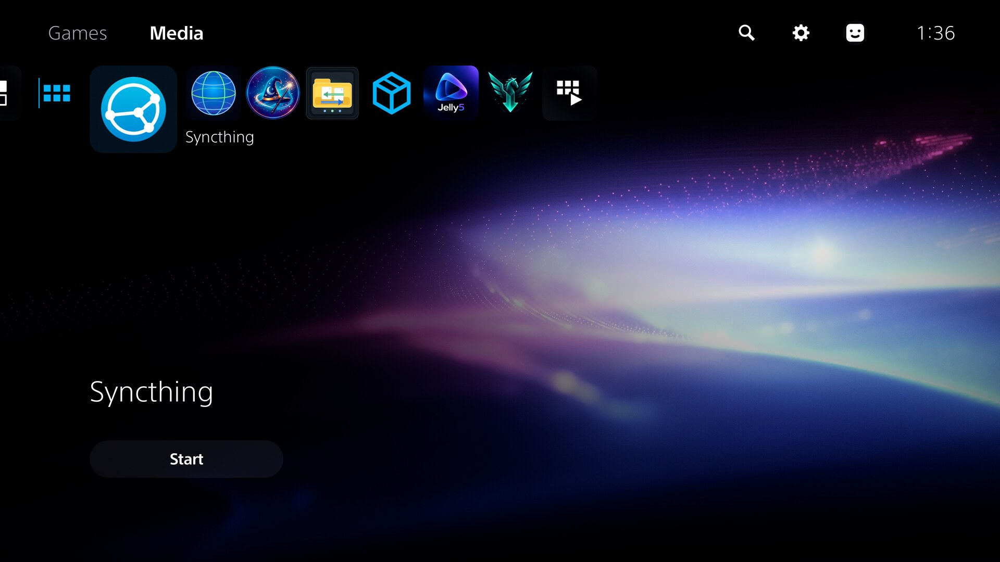
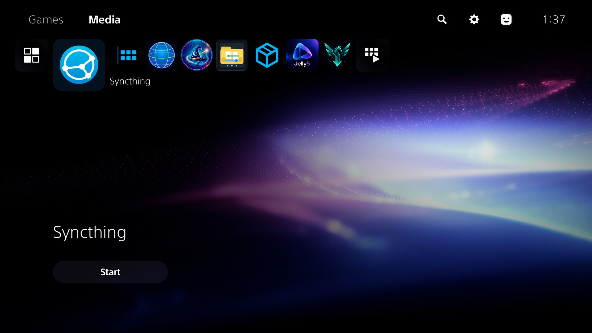

# syncps5

[Syncthing](https://github.com/syncthing/syncthing) running on a jailbroken
PS5 as a background service, packaged as a single ELF payload for an ELF
loader (e.g. [ps5-payload-dev/elfldr](https://github.com/ps5-payload-dev/elfldr)
on port 9021).

It is the unmodified Syncthing (currently **v2.1.6**, pinned as a submodule)
plus a small PS5 integration layer:

```
syncps5.elf
 ├─ launcher (C, ps5-payload-sdk)       launcher/
 │    privileges, low scheduling priority, single instance,
 │    self-install, home screen shortcut (appicon/), then loads ↓ in-process
 └─ syncthing (Go, GOOS=freebsd, PIE)   third_party/syncthing + ps5/ + patches/syncthing/
      built with Go 1.27.1 + patches/go1.27.1-ps5.patch
```

## Screenshots

The Syncthing shortcut in the Media tab of the PS5 home screen. Its link
points to the Syncthing GUI on the console (`http://127.0.0.1:8384/`).





## Using it

| | |
| --- | --- |
| Web GUI | `http://<ps5-ip>:8384` |
| Sync protocol | TCP/QUIC `22000`, local discovery UDP `21027` |
| Live log | `nc <ps5-ip> 8385` (or `tools/logs.sh`) |
| Files on the console | `/data/syncps5/`: `home/` (config, keys, database), `syncthing.log`, `launcher.log`, `syncps5.elf`, `icon-installed` |
| Home screen | a "Syncthing" shortcut in the Media tab (app `STPS00001`) |

### First run: setting the GUI password

The first time you open `http://<ps5-ip>:8384`, Syncthing shows its usual
first-run prompts. A red warning says the GUI can be reached remotely without
a password, and a notice asks you to set a GUI user and password. Set them
right away under Actions → Settings → GUI. Until you do, anyone on your
network who reaches the GUI can share any path on the console, because
Syncthing runs as root outside the sandbox.

The GUI uses plain HTTP, as Syncthing does by default, so the password
crosses your LAN unencrypted. Enable "Use HTTPS for GUI" in the same dialog
to change that. The log port 8385 has no authentication. It shows logs only,
which include device IDs and folder paths but no credentials or keys.

Then add your other devices and folders as on any Syncthing install. Folder
paths are console paths, e.g. `/data/...` or `/user/...`. New folders default
to `~/Sync` = `/data/syncps5/Sync`.

### Home screen shortcut and notifications

- The first time the payload runs, it adds a **Syncthing** shortcut to the
  **Media** tab of the home screen. It opens the GUI in the console's browser.
  If you delete the shortcut, it stays deleted. To get it back, delete
  `/data/syncps5/icon-installed` and start the payload again.
- When the GUI is up, a notification says Syncthing has started and on which
  port. If the GUI does not come up within five minutes, a notification says
  so instead.

### Behaviour as a service

- Runs in the background, also while games are played. It runs at the lowest
  time-sharing priority, with `GOMAXPROCS=4` and a soft memory limit of 768 MiB.
- Sending the payload again stops the running instance (SIGTERM, clean
  shutdown) and takes over, so it is also the way to upgrade.
- *Restart* in the GUI (or a config change that needs one) relaunches the
  payload through the ELF loader, from the newest installed copy:
  `/data/syncps5/syncps5.elf` or the one in pldmgr.
  *Shutdown* stops it for good.
- The payload is not persistent across reboots: the jailbreak and the ELF
  loader have to be loaded again, and so does this payload.
- **With Payload Manager (pldmgr):** `tools/install-pldmgr.sh` uploads the
  payload over FTP to `/data/pldmgr/payloads/syncps5/syncps5.elf`. pldmgr then
  lists it, and can start it. To start it at boot, add `syncps5.elf` to
  `/data/pldmgr/autoload.txt`, or use pldmgr's autoload settings.
- Without pldmgr, ask the ELF loader to run the installed copy:
  `echo file:/data/syncps5/syncps5.elf | nc -q0 <ps5-ip> 9021`.
- The Syncthing upgrade mechanism is disabled; upgrade by rebuilding.

## Building

Linux, with clang/lld ≥ 18, curl, unzip, rsync, git, python3 and nc.

```sh
git clone --recursive git@github.com:heydemoura/syncps5.git && cd syncps5
tools/setup-toolchain.sh        # ps5-payload-sdk, patched Go, LLVM overlay → ./toolchain
tools/build.sh                  # → out/syncps5.elf
PS5_HOST=192.168.0.221 tools/deploy.sh   # send + install, prints the launcher output
PS5_HOST=192.168.0.221 tools/logs.sh logs/ps5.log   # follow the log, reconnects across restarts
PS5_HOST=192.168.0.221 tools/install-pldmgr.sh --run # install into pldmgr over FTP and start it
```

`tools/install-pldmgr.sh` needs an FTP server on the console, on port 2121
by default (`PS5_FTP_PORT`).

`tools/deploy.sh` sends the ELF to the loader followed by a second copy that
the launcher saves as `/data/syncps5/syncps5.elf` (`--no-install` skips that).

Variables (see `tools/env.sh`): `PS5_HOST`, `PS5_PORT` (9021),
`SYNCPS5_LOG_PORT` (8385), `TOOLCHAIN_DIR`, `PS5_PAYLOAD_SDK`, `PS5_GOROOT`,
`LLVM_CONFIG`, `MAXPROCS` (build-time `GOMAXPROCS`, default 4), `GUI_PORT`
(default 8384; also used by the shortcut's link) and `EXTRA_CFLAGS`.

### Releases

GitHub Actions (`.github/workflows/build.yml`) builds the payload on every
push and pull request and keeps it as a workflow artifact. Pushing a tag
starting with `v` also publishes a GitHub release with
`syncps5-<tag>.elf` and `SHA256SUMS` attached. A tag with a hyphen, such as
`v1.0.0-rc1`, becomes a pre-release.

```sh
git tag -a v1.0.0 -m "syncps5 v1.0.0" && git push origin v1.0.0
```

### Upgrading Syncthing

```sh
git -C third_party/syncthing fetch --tags && git -C third_party/syncthing checkout vX.Y.Z
tools/build.sh
```

`patches/syncthing/` must still apply (the build stops if it does not). A
Syncthing release that needs a newer Go needs the Go patch ported first.

## How it works

The PS5 kernel is FreeBSD-based, so Go's `freebsd/amd64` port is the starting
point. The hard parts, the Go runtime patch and the in-process loader, come
from [ps5-tailscale](https://github.com/holdmysocks/ps5-tailscale), which
documents them in detail (docs/TECHNICAL.md there). In short:

- **Go patch** (`patches/go1.27.1-ps5.patch`): the kernel only has FreeBSD 9
  syscall numbers (everything ≥ 532 is a Sony syscall), so newer calls
  (`pipe2`, `accept4`, 64-bit-inode `fstat`/`getdirentries`, the new `kevent`, …)
  are emulated. It also handles Sony's larger `ucontext`, internally linked PIE
  on freebsd/amd64, and `os.Executable` without a path.
- **Launcher** (`launcher/`): the SDK's crt lets the process issue raw
  syscalls. The launcher maps the Go PIE image, applies its relocations, makes
  the text executable with `kernel_mprotect`, builds a FreeBSD-style
  argc/argv/envp/auxv block and jumps to the Go entry point.
- **Syncthing integration** (`ps5/`, copied into `cmd/syncthing` at build time):
  - **No monitor process.** Syncthing normally re-executes itself under a
    monitor, which the PS5 cannot do, so it runs as `STMONITORED=1`.
  - **Restart hook.** The Syncthing patch adds a hook before the final
    `os.Exit`. On restart it asks the ELF loader to start the installed payload
    again.
  - **Logging.** stdio is the loader's socket, and Go dies on `EPIPE` there.
    So stdout and stderr go to `syncthing.log`, which rotates at 16 MiB and is
    served on port 8385.
  - **DNS.** There is no `/etc/resolv.conf`. The resolver probes localhost, the
    default gateway and public resolvers, and uses the first one that answers.
  - **TLS roots.** There is no CA bundle, so `x509roots/fallback` is embedded.
    The relay pool and global discovery need it.
  - The SQLite database uses the pure-Go modernc driver (`CGO_ENABLED=0`).

Tested on firmware 12.40 with elfldr: two-way sync with a Linux Syncthing
over LAN, relays and global discovery (IPv4), GUI restart.

### Troubleshooting

- Nothing on 8384/8385 after deploying: read the launcher's output (printed by
  `tools/deploy.sh`) and `/data/syncps5/launcher.log`; a Go runtime crash
  before Syncthing starts ends up there or in `syncthing.log`.
- `failed to increase receive buffer size` (QUIC) is harmless.
- IPv6 discovery errors are expected on networks without IPv6.

## License

GPLv3 (see `LICENSE`): the launcher and the Go patch derive from ps5-tailscale
(GPLv3). Syncthing is MPL-2.0 and is included unmodified as a submodule apart
from `patches/syncthing/`.
